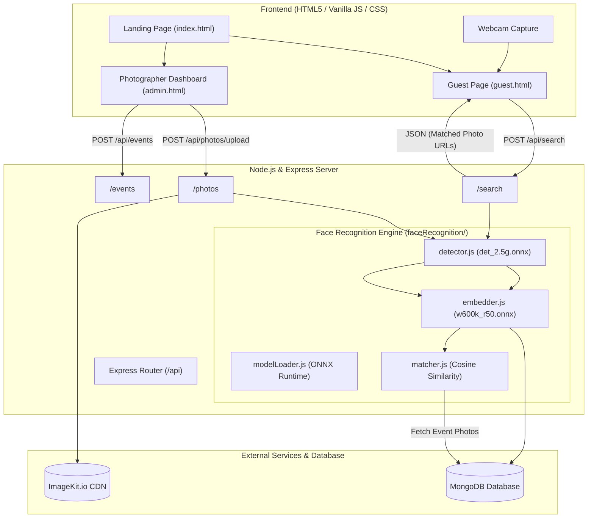

# Photo Finder 📸

[](https://nodejs.org/)
[](https://expressjs.com/)
[](https://onnxruntime.ai/)
[](https://www.mongodb.com/)
[](https://imagekit.io/)

**Photo Finder** is an AI-powered event and wedding photo distribution platform. Photographers upload high-resolution event albums in bulk, and guests instantly find every photo they appear in simply by uploading or taking a selfie — eliminating the tedious task of manually browsing through thousands of pictures.

---

## Table of Contents

- [1. Installation Guide](#1-installation-guide)
- [2. Project Overview](#2-project-overview)
- [3. Tech Stack](#3-tech-stack)
- [4. Buffalo ONNX Face Recognition](#4-buffalo-onnx-face-recognition)
- [5. System Architecture](#5-system-architecture)
- [6. How the System Works](#6-how-the-system-works)
- [7. Environment Variables](#7-environment-variables)
- [8. Face Recognition Model Setup](#8-face-recognition-model-setup)
- [9. How to Run](#9-how-to-run)
- [10. Project Structure](#10-project-structure)
- [11. API Endpoints](#11-api-endpoints)
- [12. Database Schema](#12-database-schema)
- [13. Photo Matching & Similarity Logic](#13-photo-matching--similarity-logic)
- [14. User Flows](#14-user-flows)
- [15. Backend Processing Flow](#15-backend-processing-flow)
- [16. Security & Privacy](#16-security--privacy)
- [17. Troubleshooting](#17-troubleshooting)
- [18. Features](#18-features)
- [19. Future Improvements](#19-future-improvements)
- [20. License](#20-license)

---

## 1. Installation Guide

### Prerequisites
- [Node.js](https://nodejs.org/) (version 18.0.0 or higher)
- [npm](https://www.npmjs.com/) (version 9.0.0 or higher)
- [MongoDB Atlas](https://www.mongodb.com/cloud/atlas) account (or local MongoDB instance)
- [ImageKit.io](https://imagekit.io/) account (free tier works)

### Step-by-Step Installation

1. **Clone the repository:**
   ```bash
   git clone <repository-url>
   cd wedding-photo-finder
   ```

2. **Install backend dependencies:**
   ```bash
   cd server
   npm install
   ```

3. **Verify installed packages in `server/package.json`:**
   - `express`
   - `cors`
   - `dotenv`
   - `mongoose`
   - `multer`
   - `imagekit`
   - `onnxruntime-node`
   - `sharp`

---

## 2. Project Overview

### What is Photo Finder?
At weddings, parties, corporate galas, and large events, photographers capture thousands of high-resolution photos. Guests typically face one of two frustrating options:
1. Wait weeks or months for full galleries and manually scroll through thousands of photos to spot themselves.
2. Miss out on great candid photos taken of them.

**Photo Finder** solves this problem by integrating local **InsightFace Buffalo ONNX neural networks** directly on the server to automatically detect, align, and index every face in uploaded event photos. When a guest uploads or captures a single selfie, the system extracts their face embedding, calculates cosine similarity against all indexed faces in the event, and displays all matching photos within milliseconds.

### Who Uses It?
- **Photographers / Event Organizers**: Create events, bulk-upload photos, and share an event link or auto-generated QR code with attendees.
- **Guests / Attendees**: Scan the QR code or visit the event link, snap or upload a selfie, and instantly view and download their pictures.

---

## 3. Tech Stack

### Frontend
- **HTML5 & Vanilla JavaScript (ES6+)**: Zero framework bloat, fast load times, modular event-driven scripting.
- **Vanilla CSS3**: Custom design system featuring dark luxury glassmorphism (`backdrop-filter`), gold/rose accents, responsive layouts, and animations.
- **HTML5 MediaDevices / Canvas API**: In-browser live webcam capture for instant selfies.
- **QRCode.js (`qrcode.min.js`)**: Dynamic client-side QR code generation for event guest links.

### Backend
- **Node.js & Express.js**: RESTful API server handling event management, photo uploads, and facial AI search.
- **ONNX Runtime Node (`onnxruntime-node`)**: High-performance C++ backend execution engine for local ONNX neural network inference on CPU.
- **Sharp (`sharp`)**: High-speed image processing library used for raw pixel buffer extraction, aspect-ratio letterboxing, and 112×112 face crop alignment with bilinear interpolation.
- **Multer (`multer`)**: In-memory multipart form-data processing for photo and selfie uploads.
- **CORS & Dotenv**: Cross-origin resource sharing and environment configuration management.

### Database & Storage
- **MongoDB & Mongoose**: Document database storing event metadata and photo records with 512-dimensional face embedding arrays and bounding boxes.
- **ImageKit.io (`imagekit`)**: Cloud media storage and delivery CDN for event photos and guest selfies.

---

## 4. Buffalo ONNX Face Recognition

The platform uses local **InsightFace Buffalo ONNX models** located in `server/models/buffalo_m/`. Models are initialized once at server startup into persistent `InferenceSession` singletons.

```
server/models/buffalo_m/
├── det_2.5g.onnx       # Face detection (SCRFD)
├── w600k_r50.onnx      # Face feature embedding (ArcFace ResNet-50)
├── 2d106det.onnx       # 2D 106-point facial landmarks
├── 1k3d68.onnx         # 3D 68-point facial landmarks
└── genderage.onnx      # Gender and age classification
```

### Model Roles & Usage Breakdown

| Model File | Model Architecture | Role in Pipeline | Status in Codebase |
|------------|-------------------|------------------|-------------------|
| `det_2.5g.onnx` | SCRFD (Sample and Computation Redistribution for Face Detection) | Detects all faces in images across 3 scales (strides 8, 16, 32); extracts bounding boxes and 5 keypoints (left eye, right eye, nose, left mouth, right mouth). | **Currently Used** |
| `w600k_r50.onnx` | ArcFace ResNet-50 (Glint360k) | Extracts a high-discriminant 512-dimensional vector embedding from a 112×112 aligned face crop. | **Currently Used** |
| `2d106det.onnx` | 2D 106-point Landmark Detector | Extracts fine-grained 106 landmark points on a 192×192 face crop. | **Present & Initialized** (available in `embedder.js`) |
| `1k3d68.onnx` | 3D 68-point Landmark Detector | Estimates 68 3D landmark coordinates and head pose. | **Present & Initialized** (available in `modelLoader.js`) |
| `genderage.onnx` | Age & Gender Estimator | Predicts gender classification and age estimates. | **Present & Initialized** (available in `modelLoader.js`) |

### Face Processing & Alignment Pipeline
1. **Detection (`det_2.5g.onnx`)**:
   - Image resized to 640×640 with aspect ratio letterbox.
   - Planar float32 tensor normalized via `(pixel - 127.5) / 128.0`.
   - Bounding boxes and 5 facial keypoints decoded from strides 8, 16, and 32.
   - Filtered with confidence threshold (default `0.5`) and Non-Maximum Suppression (IoU `0.4`).
2. **Alignment & Crop**:
   - Computes a 2D similarity transformation matrix (Umeyama algorithm) mapping the 5 detected keypoints to standard ArcFace 112×112 reference landmarks:
     - Left Eye: `[38.2946, 51.6963]`
     - Right Eye: `[73.5318, 51.5014]`
     - Nose: `[56.0252, 71.7366]`
     - Left Mouth: `[41.5493, 92.3655]`
     - Right Mouth: `[70.7299, 92.2041]`
   - Warps the face region into an aligned 112×112 RGB image using inverse bilinear interpolation.
3. **Embedding Generation (`w600k_r50.onnx`)**:
   - Aligned 112×112 buffer normalized to `(pixel - 127.5) / 127.5`.
   - Evaluated by `w600k_r50.onnx` to produce a raw 512-dimensional output vector.
   - Vector is $L_2$-normalized: $\hat{v} = \frac{v}{\|v\|_2}$.
4. **Similarity Comparison**:
   - Cosine similarity computed between normalized guest vector $\mathbf{a}$ and photo face vector $\mathbf{b}$:
     $$\text{Cosine Similarity} = \frac{\mathbf{a} \cdot \mathbf{b}}{\|\mathbf{a}\| \|\mathbf{b}\|}$$
   - A match is confirmed when $\text{Similarity} \ge \text{Threshold}$ (default threshold: `0.40`).

---

## 5. System Architecture



---

## 6. How the System Works

### Complete End-to-End Workflow

```
1. PHOTOGRAPHER CREATES EVENT
   Photographer opens Dashboard → Submits event name, date, location →
   Server generates unique Event ID (e.g. EVT-8TQFYA) and saves to MongoDB.

2. PHOTOGRAPHER UPLOADS PHOTOS
   Photographer selects event & drops photos →
   Server runs det_2.5g.onnx to detect all faces in each photo →
   Server aligns faces & generates 512-d embeddings via w600k_r50.onnx →
   Photo uploads to ImageKit.io →
   Record saved to MongoDB with face embeddings and bounding boxes →
   Photographer downloads/shares QR code pointing to /guest.html?event=EVT-8TQFYA.

3. GUEST FINDS PHOTOS
   Guest scans QR code or visits guest.html →
   Guest selects/verifies event code →
   Guest snaps webcam selfie or uploads image →
   Guest clicks "Find My Photos" →
   Server extracts guest face embedding using det_2.5g + w600k_r50 →
   Server queries all photos for that event in MongoDB →
   Server computes Cosine Similarity for every face in the event →
   Server filters matches where Similarity >= 0.40 →
   Guest sees gallery of their matching photos with instant View & Download links.
```

---

## 7. Environment Variables

Create a `.env` file in the `server/` directory. You can copy from `.env.example`:

```bash
cp .env.example .env
```

### Required Configuration (`server/.env`)

```env
# Server Port
PORT=4000

# MongoDB Connection String
MONGODB_URI=mongodb+srv://<username>:<password>@cluster0.xxxxx.mongodb.net/?appName=Cluster0

# ImageKit.io Credentials
IMAGEKIT_PUBLIC_KEY=public_xxxxxxxxxxxxxxxxxxxxxxx=
IMAGEKIT_PRIVATE_KEY=private_xxxxxxxxxxxxxxxxxxxxxx=
IMAGEKIT_URL_ENDPOINT=https://ik.imagekit.io/your_imagekit_id

# Face Recognition Matching Threshold (Cosine Similarity: 0.0 - 1.0)
FACE_MATCH_THRESHOLD=0.40

# Optional custom path to Buffalo ONNX models directory (defaults to server/models/buffalo_m)
# BUFFALO_MODELS_PATH=./models/buffalo_m
```

### Environment Variables Explanation

| Variable | Description |
|----------|-------------|
| `PORT` | Port number on which the Express server listens (default: `4000`). |
| `MONGODB_URI` | MongoDB connection URI for database operations. |
| `IMAGEKIT_PUBLIC_KEY` | Public key from your ImageKit Developer Console. |
| `IMAGEKIT_PRIVATE_KEY` | Private key from your ImageKit Developer Console (kept secure). |
| `IMAGEKIT_URL_ENDPOINT` | Base URL endpoint for your ImageKit media library. |
| `FACE_MATCH_THRESHOLD` | Minimum cosine similarity score (between `0.0` and `1.0`) required to qualify as a face match (recommended: `0.40` to `0.50`). |
| `BUFFALO_MODELS_PATH` | (Optional) Custom file path to directory containing the 5 Buffalo ONNX model files. |

---

## 8. Face Recognition Model Setup

The 5 InsightFace Buffalo ONNX models must be placed inside the `server/models/buffalo_m/` directory:

```text
server/
└── models/
    └── buffalo_m/
        ├── 1k3d68.onnx       # (~137 MB)
        ├── 2d106det.onnx     # (~5 MB)
        ├── det_2.5g.onnx     # (~3.2 MB)
        ├── genderage.onnx    # (~1.3 MB)
        └── w600k_r50.onnx    # (~166 MB)
```

### Verify Model Integrity
You can run the built-in integration test to verify all models load and execute properly:

```bash
cd server
node test_buffalo_integration.js
```

**Expected Output:**
```text
==================================================
  BUFFALO ONNX FACE RECOGNITION INTEGRATION TEST  
==================================================

✓ det_2.5g.onnx loaded
✓ w600k_r50.onnx loaded
✓ 2d106det.onnx loaded
✓ 1k3d68.onnx loaded
✓ genderage.onnx loaded (available)
✓ Face detection pipeline operational (evaluated test canvas)
✓ Face embedding generated (Vector dimensions: 512)
✓ Embedding comparison working (Self-similarity: 1.0000)
✓ Matching photos test: Found 1 matching photo(s) (Top match score: 1)

==================================================
  ALL BUFFALO ONNX INTEGRATION CHECKS PASSED ✓   
==================================================
```

---

## 9. How to Run

### Development Mode (with automatic restart on file edits)
```bash
cd server
npm run dev
```

### Production Mode
```bash
cd server
npm start
```

### Accessing the Web Application
Once the server starts, open your browser:
- **Landing Page**: [http://localhost:4000](http://localhost:4000)
- **Guest Search Page**: [http://localhost:4000/guest.html](http://localhost:4000/guest.html)
- **Photographer Dashboard**: [http://localhost:4000/admin.html](http://localhost:4000/admin.html)

---

## 10. Project Structure

```text
wedding-photo-finder/
├── client/                               # Frontend client files (served statically)
│   ├── index.html                        # Landing page (Role selection)
│   ├── guest.html                        # Guest search modal & photo gallery
│   ├── guest.js                          # Guest search & webcam client logic
│   ├── admin.html                        # Photographer dashboard & event management
│   ├── admin.js                          # Event creation & bulk upload logic
│   ├── style.css                         # Universal dark luxury glassmorphism stylesheet
│   └── background.jpg                    # Photography flatlay background asset
│
├── server/                               # Node.js + Express backend
│   ├── server.js                         # Application entrypoint & static middleware
│   ├── package.json                      # Backend dependencies and scripts
│   ├── .env                              # Environment secrets (ignored in git)
│   ├── .env.example                      # Template for environment variables
│   ├── test_buffalo_integration.js       # Standalone ONNX integration test script
│   │
│   ├── controllers/                      # Route handlers
│   │   ├── eventController.js            # Event CRUD operations
│   │   ├── photoController.js            # Photo upload & Buffalo face indexing
│   │   └── searchController.js           # Guest selfie processing & photo matching
│   │
│   ├── routes/                           # API route definitions
│   │   ├── eventRoutes.js                # /api/events
│   │   ├── photoRoutes.js                # /api/photos
│   │   └── searchRoutes.js               # /api/search
│   │
│   ├── models/                           # Database & AI model definitions
│   │   ├── Event.js                      # Mongoose Event schema
│   │   ├── Photo.js                      # Mongoose Photo schema (with face embeddings)
│   │   └── buffalo_m/                    # InsightFace Buffalo ONNX model files
│   │       ├── det_2.5g.onnx
│   │       ├── w600k_r50.onnx
│   │       ├── 2d106det.onnx
│   │       ├── 1k3d68.onnx
│   │       └── genderage.onnx
│   │
│   ├── faceRecognition/                  # Modular AI Face Recognition Service
│   │   ├── modelLoader.js                # ONNX Runtime persistent session manager
│   │   ├── detector.js                   # SCRFD face detector & landmark extractor
│   │   ├── embedder.js                   # 112x112 similarity aligner & ArcFace embedder
│   │   ├── matcher.js                    # Cosine similarity & photo match filtering
│   │   └── index.js                      # Unified face recognition interface
│   │
│   ├── services/                         # Shared services
│   │   ├── faceService.js                # Face recognition service wrapper
│   │   └── imagekitService.js            # ImageKit upload integration
│   │
│   └── utils/                            # Helper utilities
│       ├── db.js                         # MongoDB connection initializer
│       └── generateId.js                 # Event code generator (e.g. EVT-8TQFYA)
│
└── README.md                             # Complete project documentation
```

---

## 11. API Endpoints

All API endpoints are prefixed with `/api`.

### 1. Health Check
```http
GET /api/health
```
- **Description**: Verifies that the backend server is running.
- **Response (200 OK):**
  ```json
  {
    "success": true,
    "message": "Wedding Photo Finder server is running."
  }
  ```

---

### 2. List Events
```http
GET /api/events
```
- **Description**: Retrieves all wedding events sorted newest first.
- **Response (200 OK):**
  ```json
  {
    "success": true,
    "events": [
      {
        "_id": "6a843442619cbda6903fdffe",
        "eventId": "EVT-8TQFYA",
        "name": "Rahul & Priya Wedding",
        "date": "2026-11-20T00:00:00.000Z",
        "location": "Kolkata",
        "createdAt": "2026-08-18T10:30:26.539Z"
      }
    ]
  }
  ```

---

### 3. Create Event
```http
POST /api/events
```
- **Description**: Creates a new event with an auto-generated unique `eventId`.
- **Request Body (JSON):**
  ```json
  {
    "name": "Rahul & Priya Wedding",
    "date": "2026-11-20",
    "location": "Kolkata"
  }
  ```
- **Response (201 Created):**
  ```json
  {
    "success": true,
    "event": {
      "_id": "6a843442619cbda6903fdffe",
      "eventId": "EVT-8TQFYA",
      "name": "Rahul & Priya Wedding",
      "date": "2026-11-20T00:00:00.000Z",
      "location": "Kolkata",
      "createdAt": "2026-08-18T10:30:26.539Z"
    }
  }
  ```
- **Error (400 Bad Request):** If `name`, `date`, or `location` are missing.

---

### 4. Get Event by ID
```http
GET /api/events/:eventId
```
- **Description**: Fetches single event details by its code (e.g. `EVT-8TQFYA`).
- **Response (200 OK):**
  ```json
  {
    "success": true,
    "event": {
      "eventId": "EVT-8TQFYA",
      "name": "Rahul & Priya Wedding",
      "date": "2026-11-20T00:00:00.000Z",
      "location": "Kolkata"
    }
  }
  ```
- **Error (404 Not Found):** If event ID does not exist.

---

### 5. Upload Event Photo
```http
POST /api/photos/upload
```
- **Description**: Uploads a photo, extracts Buffalo ONNX face embeddings for all faces present, stores image on ImageKit, and creates a MongoDB document.
- **Request (multipart/form-data):**
  - `photo`: Image file binary (JPEG/PNG/WebP)
  - `eventId`: String (e.g. `EVT-8TQFYA`)
- **Response (200 OK):**
  ```json
  {
    "success": true,
    "photo": {
      "id": "66c1f0a12080c3e59298eb30",
      "imageUrl": "https://ik.imagekit.io/09cqtgxxz/wedding-photo-finder/events/EVT-8TQFYA/photos/img_1.jpg",
      "faceCount": 3
    }
  }
  ```

---

### 6. Search Photos by Selfie
```http
POST /api/search
```
- **Description**: Receives guest selfie, generates 512-d ArcFace embedding, compares against all indexed event photos via cosine similarity, and returns matching photos.
- **Request (multipart/form-data):**
  - `selfie`: Image file binary (JPEG/PNG/WebP)
  - `eventId`: String (e.g. `EVT-8TQFYA`)
- **Response (200 OK):**
  ```json
  {
    "success": true,
    "matches": [
      {
        "imageUrl": "https://ik.imagekit.io/09cqtgxxz/wedding-photo-finder/events/EVT-8TQFYA/photos/img_1.jpg",
        "similarity": 0.8245,
        "distance": 0.1755
      }
    ]
  }
  ```
- **No Matches (200 OK):**
  ```json
  {
    "success": true,
    "matches": [],
    "message": "No matching photos found. Try another clear selfie."
  }
  ```

---

## 12. Database Schema

### 1. `Event` Collection (`server/models/Event.js`)
| Field | Type | Required | Description |
|-------|------|----------|-------------|
| `eventId` | String | Yes (Unique) | Short event code (e.g., `EVT-8TQFYA`). |
| `name` | String | Yes | Name of the wedding or event. |
| `date` | Date | Yes | Date of the event. |
| `location` | String | Yes | Venue or city location. |
| `createdAt` | Date | Auto | Timestamp of event creation. |

### 2. `Photo` Collection (`server/models/Photo.js`)
| Field | Type | Required | Description |
|-------|------|----------|-------------|
| `eventId` | String | Yes (Indexed) | Foreign reference linking photo to the event. |
| `imageKitFileId` | String | Yes | Unique file ID assigned by ImageKit.io. |
| `imageUrl` | String | Yes | Public CDN URL to the high-resolution photo. |
| `filePath` | String | Yes | Storage folder path on ImageKit. |
| `faces` | Array | No | Array of detected face objects (see structure below). |
| `createdAt` | Date | Auto | Timestamp of photo upload. |

#### `faces` Array Structure:
```json
[
  {
    "embedding": [0.0421, -0.0152, ..., 0.0891], // 512 float numbers
    "boundingBox": { "x": 340, "y": 210, "width": 140, "height": 180 },
    "score": 0.9421,
    "landmarks": [[375, 260], [445, 260], [410, 305], [380, 345], [440, 345]]
  }
]
```

---

## 13. Photo Matching & Similarity Logic

```
   Guest Selfie Image
          ↓
  SCRFD Face Detection (det_2.5g.onnx)
          ↓ (Extracts 5 landmarks: eyes, nose, mouth corners)
  Similarity Transform Alignment (112×112)
          ↓
  ArcFace Feature Extraction (w600k_r50.onnx)
          ↓
  L2 Normalization (512-dim unit vector)
          ↓
  Compare with All Faces in Event Photos (Cosine Similarity)
          ↓
  Filter Matches (Similarity >= 0.40)
          ↓
  Sort by Highest Similarity Score
          ↓
  Return Matching Photo URLs to Guest
```

### Scenario Handling

| Scenario | System Behavior |
|----------|-----------------|
| **No face detected in selfie** | Returns `400 Bad Request`: *"No face detected in selfie. Please upload a clear photo showing your face."* |
| **Multiple faces in selfie** | System selects the most prominent face (largest bounding box area) as the search subject. |
| **Multiple faces in an event photo** | The photo is matched if *any* face in the photo exceeds the similarity threshold with the guest selfie. |
| **No matching photos found** | Returns `200 OK` with empty matches array and user-friendly guidance message. |
| **Matches found** | Returns array of matching photos sorted from highest to lowest similarity score. |

---

## 14. User Flows

### Photographer Journey
1. Open **[http://localhost:4000/admin.html](http://localhost:4000/admin.html)**.
2. Fill out **"Create an Event"** form (Event Name, Date, Location) and click **"Create Event"**.
3. Event is created with a unique code (e.g. `EVT-8TQFYA`).
4. Select the event from the dropdown, choose/drop wedding photos, and click **"Upload Photos"**.
5. Server indexes all faces with Buffalo ONNX and uploads photos to ImageKit.
6. The dashboard displays the event's guest link and generates a downloadable **QR Code** to share with guests.

### Guest Journey
1. Scan the photographer's QR code or visit **[http://localhost:4000/guest.html](http://localhost:4000/guest.html)**.
2. The event is automatically detected from URL parameter (or selected from dropdown / entered manually).
3. Click **"📷 Take Selfie"** (live webcam) or **"📁 Upload Photo"** (browse from device).
4. Review the instant selfie preview with option to retake or remove.
5. Click **"✨ Find My Photos"**.
6. View matching photos in a responsive gallery with **"View"** (full resolution in new tab) and **"Download"** options.

---

## 15. Backend Processing Flow

```
Client Request (multipart/form-data)
       ↓
Express Router & Multer (Memory Storage Buffer)
       ↓
Controller Handler (photoController / searchController)
       ↓
Face Recognition Service (faceRecognition/index.js)
       ↓
ONNX Runtime C++ Engine
       ├── det_2.5g.onnx (SCRFD Detection & 5 Landmark Keypoints)
       ├── Sharp Image Transformer (112×112 Similarity Alignment)
       └── w600k_r50.onnx (512-dim Normalized Embedding)
       ↓
Database & Storage Layer
       ├── MongoDB (Query event photos / Save embeddings)
       └── ImageKit.io (Media CDN upload)
       ↓
Cosine Similarity Matcher (Threshold Filtering & Sorting)
       ↓
JSON Response to Client
```

---

## 16. Security & Privacy

- **Biometric Privacy**: Face embeddings are 512-dimensional numerical vectors. Raw facial biometric representations are used strictly for similarity comparison within the scope of the specific event.
- **In-Memory Buffer Processing**: Image files are processed directly from memory buffers using `multer.memoryStorage()` without saving unencrypted temporary files to the server disk.
- **Environment Variable Protection**: All API keys, database credentials, and secrets are stored in `.env` and excluded from version control via `.gitignore`.
- **Event Scope Isolation**: Photo searches are strictly scoped to the `eventId` requested, preventing cross-event photo indexing leaks.

---

## 17. Troubleshooting

### 1. `EADDRINUSE: address already in use :::4000`
- **Cause**: Another node process is already listening on port 4000.
- **Solution**:
  - Windows:
    ```powershell
    Get-Process -Id (Get-NetTCPConnection -LocalPort 4000).OwningProcess | Stop-Process -Force
    ```
  - Or change `PORT=5000` in `server/.env`.

### 2. `Required Buffalo ONNX model files not found`
- **Cause**: The ONNX model files are missing from `server/models/buffalo_m/`.
- **Solution**: Ensure all 5 `.onnx` files (`det_2.5g.onnx`, `w600k_r50.onnx`, `2d106det.onnx`, `1k3d68.onnx`, `genderage.onnx`) exist in `server/models/buffalo_m/`.

### 3. `MongoDB connection error / MongooseError`
- **Cause**: Incorrect `MONGODB_URI` or IP address not whitelisted in MongoDB Atlas.
- **Solution**:
  1. Verify the connection string in `server/.env`.
  2. In MongoDB Atlas, go to **Network Access** → **Add IP Address** → choose **Allow Access From Anywhere (`0.0.0.0/0`)** for development.

### 4. `ImageKit upload error: Invalid Key`
- **Cause**: Missing or incorrect ImageKit API credentials.
- **Solution**: Verify `IMAGEKIT_PUBLIC_KEY`, `IMAGEKIT_PRIVATE_KEY`, and `IMAGEKIT_URL_ENDPOINT` in `server/.env`.

### 5. `No face detected in selfie`
- **Cause**: Uploaded selfie is blurry, poorly lit, or has the face obstructed.
- **Solution**: Upload a clear, front-facing portrait photo with adequate lighting.

---

## 18. Features

- [x] **Event Management**: Create wedding/event records with auto-generated short codes (e.g. `EVT-8TQFYA`).
- [x] **Bulk Photo Upload**: Multi-file drag-and-drop photographer upload with real-time progress indicators.
- [x] **Automated Facial Indexing**: Server-side SCRFD face detection and ArcFace 512-d feature extraction.
- [x] **AI Selfie Matching**: Instant face search powered by ONNX Runtime and cosine similarity.
- [x] **Live Webcam Capture**: In-browser front camera selfie capture modal with face alignment framing.
- [x] **Dynamic QR Code Generation**: Auto-generated QR codes linking guests directly to their event search page.
- [x] **Cloud Media CDN**: ImageKit.io integration for fast high-resolution photo delivery and direct downloads.
- [x] **Luxury Dark UI**: Responsive, frosted glassmorphism interface with gold/rose aesthetics.

---

## 19. Future Improvements

*(These represent potential future enhancements and are not currently part of the active codebase)*:
- **Vector Database Integration**: Integrate Milvus, Qdrant, or Pinecone for sub-millisecond vector indexing across millions of photos.
- **GPU Acceleration**: Add CUDA/DirectML execution provider support in `onnxruntime-node` for faster batch uploads on GPU servers.
- **Batch ZIP Downloads**: Allow guests to download all their matched photos in a single `.zip` archive.
- **Admin Authentication**: Add JWT/OAuth authentication for photographer dashboard access.
- **Client Face Grouping**: Automatic album clustering for VIP guests, bride & groom.

---

## 20. License

This project is licensed under the [MIT License](LICENSE).
